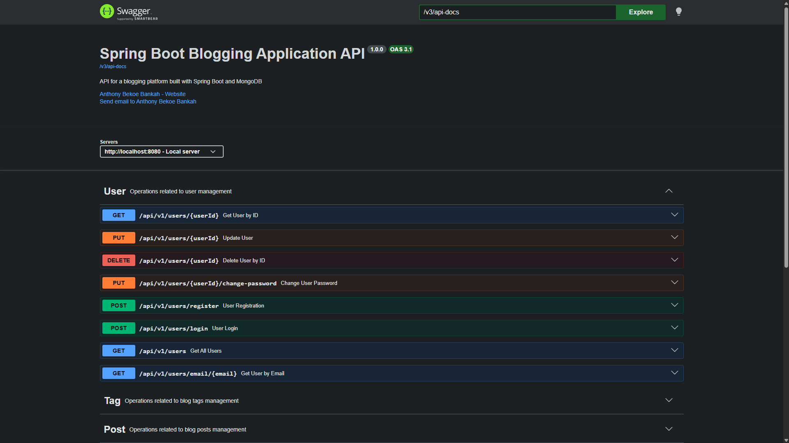

# 🍃 Spring Boot Blogging App

[](https://www.oracle.com/java/)
[](https://spring.io/projects/spring-boot)
[](https://www.mongodb.com/)
[](https://maven.apache.org/)

A RESTful API for a blogging application built with Spring Boot. This project showcases a clean architecture, secure JWT-based authentication, and full CRUD functionality for posts, comments, and tags.

---

## ✨ Features

*   **User Authentication:** Secure JWT-based authentication for user registration and login.
*   **User Management:** Endpoints for managing user profiles.
*   **Post Management:** Full CRUD (Create, Read, Update, Delete) operations for blog posts.
*   **Commenting:** Allows users to comment on posts.
*   **Tagging:** Enables categorization of posts with tags.
*   **Review Management:** Allows users to add reviews to posts.
*   **Efficient Data Handling:** Supports pagination, sorting, and filtering of data.
*   **API Documentation:** Interactive API documentation with Swagger UI.
*   **Input Validation**: Bean Validation with meaningful error messages.
*   **Layered Architecture**: Clear separation using the service layer pattern.

---

## 🛠️ Tech Stack

*   **Java 21**
*   **Spring Boot 4.0.2**
*   **Spring Data MongoDB**
*   **Spring Boot Validation**
*   **MongoDB**
*   **Maven**
*   **jBCrypt:** For password hashing.
*   **JSON Web Token (JWT):** For authentication.
*   **SpringDoc OpenAPI:** For API documentation.
*   **Spring Boot AOP:** For logging and performance monitoring.

---

## 📋 Prerequisites

Ensure the following are installed and running:

*   ☕ **Java 21+**
*   🍃 **MongoDB** (running on `localhost:27017`)
*   🔨 **Maven 3.6+**
*   🖥️ **IDE** (IntelliJ IDEA, Eclipse, or VS Code)

---

## 🚀 Getting Started

### 1️⃣ Clone the Repository

```bash
git clone https://github.com/bankah-junior/SpringBootBloggingApp.git
cd SpringBootBloggingApp
```

### 2️⃣ Start MongoDB

Ensure your MongoDB instance is running locally.

### 3️⃣ Build and Run the Application

```bash
mvn clean install
mvn spring-boot:run
```

The application will be available at:
👉 **[http://localhost:8080](http://localhost:8080)**

---

## 📡 REST API Endpoints

### User Management

| HTTP Method | Endpoint                       | Description                |
| ----------- | ------------------------------ | -------------------------- |
| `POST`      | `/api/v1/users/register`       | Create a new user          |
| `POST`      | `/api/v1/users/login`          | Login a user               |
| `GET`       | `/api/v1/users`                | Retrieve all users         |
| `GET`       | `/api/v1/users/{id}`           | Retrieve user by ID        |
| `PUT`       | `/api/v1/users/{id}`           | Update an existing user    |
| `DELETE`    | `/api/v1/users/{id}`           | Delete a user              |
| `PUT`       | `/api/v1/users/update-password`| Update user password       |

### Post Management

| HTTP Method | Endpoint             | Description              |
| ----------- | -------------------- | ------------------------ |
| `POST`      | `/api/v1/posts`      | Create a new post        |
| `GET`       | `/api/v1/posts`      | Retrieve all posts       |
| `GET`       | `/api/v1/posts/{id}` | Retrieve post by ID      |
| `PUT`       | `/api/v1/posts/{id}` | Update an existing post  |
| `DELETE`    | `/api/v1/posts/{id}` | Delete a post            |

### Comment Management

| HTTP Method | Endpoint                 | Description               |
| ----------- | ------------------------ | ------------------------- |
| `POST`      | `/api/v1/comments`       | Create a new comment      |
| `GET`       | `/api/v1/comments/{id}`  | Retrieve comment by ID    |
| `GET`       | `/api/v1/comments/post/{postId}` | Retrieve comments by post |
| `PUT`       | `/api/v1/comments/{id}`  | Update an existing comment|
| `DELETE`    | `/api/v1/comments/{id}`  | Delete a comment          |

### Tag Management

| HTTP Method | Endpoint             | Description              |
| ----------- | -------------------- | ------------------------ |
| `POST`      | `/api/v1/tags`       | Create a new tag         |
| `POST`      | `/api/v1/tags/assign`| Assign a tag to a post   |
| `GET`       | `/api/v1/tags`       | Retrieve all tags        |
| `GET`       | `/api/v1/tags/post/{postId}` | Retrieve tags by post  |
| `DELETE`    | `/api/v1/tags/{id}`  | Delete a tag             |

### Review Management

| HTTP Method | Endpoint                                  | Description                  |
|-------------|-------------------------------------------|------------------------------|
| `POST`      | `/api/v1/reviews/create`                  | Create a new review          |
| `DELETE`    | `/api/v1/reviews/delete/{reviewId}`       | Delete a review by ID        |
| `PUT`       | `/api/v1/reviews/update`                  | Update an existing review    |
| `GET`       | `/api/v1/reviews`                         | Retrieve all reviews         |
| `GET`       | `/api/v1/reviews/post/{postId}`           | Retrieve reviews for a post  |
| `GET`       | `/api/v1/reviews/post/{postId}/average-rating` | Get average rating for a post|

---

## GraphQL 
### 1️⃣ GraphQL Endpoint

The GraphQL endpoint is available at:
👉 **[http://localhost:8080/graphql](http://localhost:8080/graphql)**

### 2️⃣ GraphQL Playground

You can use the GraphQL Playground to test queries and mutations. Access it at:
👉 **[http://localhost:8080/graphiql](http://localhost:8080/graphiql)**

---

## 🔬 Aspect-Oriented Programming (AOP)

This project uses Spring Boot AOP to address cross-cutting concerns like logging and performance monitoring.

### Logging

*   **`LoggingAspect`**: Automatically logs method calls, arguments, return values, and exceptions thrown within the service layer (`com.amalitech.SpringBootBloggingApp.service.impl`). This provides valuable insight into the application's runtime behavior without cluttering the business logic with logging statements.

### Performance Monitoring

*   **`PerformanceAspect`**: Measures and logs the execution time for all methods in the service layer. This helps in identifying performance bottlenecks and optimizing slow-running operations.

---

## 🔧 Usage Examples

### ➕ Create User

```bash
curl -X POST http://localhost:8080/api/v1/users/register \
  -H "Content-Type: application/json" \
  -d '{
    "username": "john.doe",
    "email": "john.doe@example.com",
    "password": "password123"
  }'
```

### ➕ Create Post

```bash
curl -X POST http://localhost:8080/api/v1/posts \
  -H "Content-Type: application/json" \
  -H "Authorization: Bearer <your-jwt-token>" \
  -d '{
    "title": "My First Post",
    "content": "This is the content of my first post.",
    "published": true
  }'
```

---

## ⚙️ Configuration

The application uses different configuration profiles for `dev`, `test`, and `prod` environments. You can set the active profile in the `application.yml` file or via environment variables.

MongoDB configuration (`application.yml`):

```yaml
spring:
  data:
    mongodb:
      uri: mongodb://localhost:27017/blogging_platform
      database: blogging_platform
  profiles:
    active: dev

springdoc:
  api-docs:
    enabled: true
  swagger-ui:
    enabled: true
```

You can create a `.env` file in the root of the project to override the default configuration. See `.env.example` for more details.

---

## 🏗️ Project Structure

```
├── 📁 .mvn
│   └── 📁 wrapper
│       └── 📄 maven-wrapper.properties
├── 📁 src
│   ├── 📁 main
│   │   ├── 📁 java
│   │   │   └── 📁 com
│   │   │       └── 📁 amalitech
│   │   │           └── 📁 SpringBootBloggingApp
│   │   │               ├── 📁 config
│   │   │               │   └── ☕ CorsConfig.java
│   │   │               ├── 📁 controller
│   │   │               │   ├── ☕ CommentController.java
│   │   │               │   ├── ☕ PostController.java
│   │   │               │   ├── ☕ ReviewController.java
│   │   │               │   ├── ☕ TagController.java
│   │   │               │   └── ☕ UserController.java
│   │   │               ├── 📁 model
│   │   │               │   ├── 📁 dto
│   │   │               │   │   ├── 📁 request
│   │   │               │   │   │   ├── ☕ LoginRequest.java
│   │   │               │   │   │   ├── ☕ RegisterRequest.java
│   │   │               │   │   │   ├── ☕ UpdatePasswordRequest.java
│   │   │               │   │   │   ├── ☕ UpdateUserDetailRequest.java
│   │   │               │   │   │   └── ☕ UpdateUserRequest.java
│   │   │               │   │   └── 📁 response
│   │   │               │   │       └── ☕ UserResponse.java
│   │   │               │   └── 📁 entity
│   │   │               │       ├── ☕ Comment.java
│   │   │               │       ├── ☕ Post.java
│   │   │               │       ├── ☕ PostTag.java
│   │   │               │       ├── ☕ Review.java
│   │   │               │       ├── ☕ Tag.java
│   │   │               │       └── ☕ User.java
│   │   │               ├── 📁 repository
│   │   │               │   ├── 📁 impl
│   │   │               │   │   ├── ☕ CommentRepositoryImpl.java
│   │   │               │   │   ├── ☕ PostRepositoryImpl.java
│   │   │               │   │   ├── ☕ ReviewRepositoryImpl.java
│   │   │               │   │   ├── ☕ TagRepositoryImpl.java
│   │   │               │   │   └── ☕ UserRepositoryImpl.java
│   │   │               │   ├── ☕ BaseRepository.java
│   │   │               │   ├── ☕ CommentRepository.java
│   │   │               │   ├── ☕ PostRepository.java
│   │   │               │   ├── ☕ ReviewRepository.java
│   │   │               │   ├── ☕ TagRepository.java
│   │   │               │   └── ☕ UserRepository.java
│   │   │               ├── 📁 service
│   │   │               │   ├── 📁 impl
│   │   │               │   │   ├── ☕ CommentServiceImpl.java
│   │   │               │   │   ├── ☕ PostServiceImpl.java
│   │   │               │   │   ├── ☕ ReviewServiceImpl.java
│   │   │               │   │   ├── ☕ TagServiceImpl.java
│   │   │               │   │   └── ☕ UserServiceImpl.java
│   │   │               │   ├── ☕ CommentService.java
│   │   │               │   ├── ☕ PostService.java
│   │   │               │   ├── ☕ ReviewService.java
│   │   │               │   ├── ☕ TagService.java
│   │   │               │   └── ☕ UserService.java
│   │   │               ├── 📁 util
│   │   │               │   ├── 📁 exceptions
│   │   │               │   │   └── ☕ UserInputsException.java
│   │   │               │   ├── ☕ JwtUtil.java
│   │   │               │   ├── ☕ PasswordUtil.java
│   │   │               │   └── ☕ ValidationUtil.java
│   │   │               └── ☕ SpringBootBloggingAppApplication.java
│   │   └── 📁 resources
│   │       ├── 📁 static
│   │       ├── 📁 templates
│   │       └── ⚙️ application.yml
│   └── 📁 test
│       └── 📁 java
│           └── 📁 com
│               └── 📁 amalitech
│                   └── 📁 SpringBootBloggingApp
│                       └── ☕ SpringBootBloggingAppApplicationTests.java
├── ⚙️ .env.example
├── ⚙️ .gitattributes
├── ⚙️ .gitignore
├── 📝 CORS.md
├── 📄 LICENSE
├── 📝 README.md
├── 📄 mvnw
├── 📄 mvnw.cmd
└── ⚙️ pom.xml
```

---

## 📚 Documentation

*   **Swagger UI**: Available at `http://localhost:8080/swagger-ui.html`
*   **Code Documentation**: Inline Javadoc comments across the codebase.

### Swagger UI Screenshots




---

## 📈 Performance

A performance report comparing REST and GraphQL performance and evaluating API optimization is available in the `docs` folder. See [PERFORMANCE_REPORT.md](docs/PERFORMANCE_REPORT.md) for more details.

---

## 📄 License

This project is licensed under the MIT License. See the [LICENSE](LICENSE) file for details.
