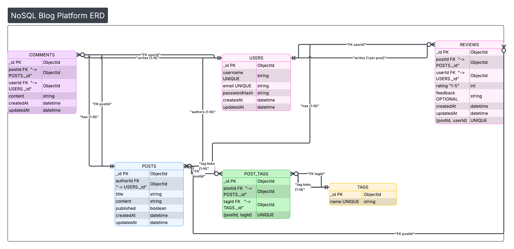

# THOUGHTPROCESS.md  
Smart Blogging Platform – Database Fundamentals Project

## 1. Project Understanding

This project is designed to evaluate my ability to design, implement, and optimize a **data-driven application** rather than simply build a feature-rich UI.

Although the domain is a *blogging platform*, the core focus areas are:
- Database modeling and normalization
- Data access patterns and performance optimization
- Practical application of Data Structures & Algorithms (DSA)
- Integration of databases with a JavaFX application using clean architecture

Therefore, my approach prioritizes **data integrity, scalability, and performance**, with UI serving as a means to interact with the data layer.

---

## 2. Design Philosophy

I approached this project using the following guiding principles:

1. **Separation of Concerns**
   - UI logic, business logic, and data access are clearly separated.
   - This improves maintainability, testability, and scalability.

2. **Database-First Design**
   - The database schema was designed before application coding.
   - Real-world relationships (Users, Posts, Comments, Tags, Reviews) guided the schema.

3. **Performance-Aware Development**
   - Every frequently accessed operation is evaluated for optimization potential.
   - Indexing, caching, and algorithmic efficiency are deliberately applied and measured.

---

## 3. Database Design Thought Process

### 3.1 Conceptual Modeling
At the conceptual level, I identified the core entities of a blogging system:
- User
- Post
- Comment
- Tag
- Review

The relationships reflect real-world blogging logic:
- A User can author many Posts
- A Post can have many Comments
- Posts and Tags form a many-to-many relationship
- Reviews and comments may contain unstructured or evolving data

This abstraction ensures flexibility and clarity before implementation details are introduced.

---

### 3.2 Logical Modeling
In the logical model:
- Each entity was assigned a unique primary key
- Relationships were represented using foreign keys
- Many-to-many relationships were resolved using junction tables (e.g., `post_tags`)
- Attributes were carefully analyzed to eliminate redundancy

Normalization up to **Third Normal Form (3NF)** was applied to:
- Prevent data anomalies
- Ensure data consistency
- Reduce duplication

---

### 3.3 Physical Modeling
In the physical model:
- NoSQL (MongoDB) was chosen for its flexibility and scalability
- Collections were designed to reflect entities while allowing for embedded documents where appropriate (e.g., comments within posts)
- Indexes were created on frequently queried fields (e.g., `username`, `post_date`, `tags`)
- Denormalization was applied judiciously to optimize read performance without sacrificing data integrity

---

## 4. SQL vs NoSQL Design Decision

### 1. When to Choose an **SQL (Relational) Database**

Choose **SQL** when **data consistency, structure, and relationships matter**.

#### ✅ Best Scenarios for SQL

##### 1. Structured, well-defined data

* Data fits naturally into **tables**
* Columns and data types are known in advance

**Example:**

* Banking systems
* School records
* Payroll systems

---

##### 2. Strong relationships between data

* Many joins between tables
* Complex queries

**Example:**

* Students ↔ Courses ↔ Grades
* Orders ↔ Customers ↔ Products

SQL handles **JOINs** very efficiently.

---

##### 3. High data integrity & consistency (ACID)

SQL databases follow **ACID properties**:

* **Atomicity**
* **Consistency**
* **Isolation**
* **Durability**

**Example where this is critical:**

* Money transfers
* Inventory systems
* Airline bookings

You *cannot* afford wrong or partial data.

---

##### 4. Complex querying & reporting

* Aggregations (`SUM`, `AVG`, `GROUP BY`)
* Nested queries
* Analytics

**Example:**

* Business reports
* Financial analysis
* Auditing systems

---

##### 5. Smaller to medium scale with predictable growth

* Vertical scaling (better hardware)
* Stable schema

---

#### 📌 Real-world SQL examples

* Banks → PostgreSQL, Oracle
* Universities → MySQL
* Enterprise ERP systems → SQL Server

---

### 2. When to Choose a **NoSQL Database**

Choose **NoSQL** when **flexibility, scalability, and speed** matter more than strict structure.

#### ✅ Best Scenarios for NoSQL

##### 1. Rapidly changing or flexible data structure

* Schema changes frequently
* Different records have different fields

**Example:**

* User profiles (optional fields)
* Social media posts
* Product catalogs with varying attributes

---

##### 2. Massive scale & high traffic

* Millions of users
* Big data
* Horizontal scaling (add more servers)

**Example:**

* Social networks
* Messaging apps
* Real-time analytics

---

##### 3. Low-latency, high-speed reads/writes

* Performance > strict consistency

**Example:**

* Caching (Redis)
* Session storage
* Real-time dashboards

---

##### 4. Semi-structured or unstructured data

* JSON, documents, logs

**Example:**

* Event logs
* IoT sensor data
* Clickstream data

---

##### 5. Distributed systems & global apps

* Data replicated across regions
* Eventual consistency is acceptable

**Example:**

* Content delivery systems
* Recommendation engines

---

#### 📌 Real-world NoSQL examples

* Facebook → Cassandra
* Netflix → DynamoDB
* Twitter → Redis
* LinkedIn → Espresso (custom NoSQL)

---

### 3. Side-by-Side Comparison

| Feature        | SQL             | NoSQL                    |
| -------------- | --------------- | ------------------------ |
| Schema         | Fixed           | Flexible                 |
| Relationships  | Strong          | Weak / embedded          |
| Consistency    | Strong (ACID)   | Eventual (often)         |
| Scaling        | Vertical        | Horizontal               |
| Query language | SQL             | API-based                |
| Best for       | Structured data | Big, fast, flexible data |

---

### 4. Realistic Scenario Examples

#### Scenario 1: Banking App

👉 **SQL**

* Transactions must be accurate
* Strong consistency required

---

#### Scenario 2: Social Media App

👉 **NoSQL**

* Billions of posts
* Fast reads/writes
* Flexible data

---

#### Scenario 3: E-commerce Platform

👉 **Both (Hybrid approach)**

* **SQL** → Orders, payments, inventory
* **NoSQL** → Product search, recommendations, user activity

✅ This is very common in real systems.

---

### 5. Decision for This Project (NoSQL)
For the Smart Blogging Platform, I chose **NoSQL (MongoDB)** because:
- Blog posts and comments have **flexible structures**
- Tags and reviews may evolve over time
- The platform may need to **scale horizontally** with many users
- Read performance is prioritized for content delivery
- Write operations (like creating a post) are less frequent than reads
- The platform handles high read volumes more efficiently than write volumes


---

## 5. Application Architecture Thought Process

The application follows a **layered architecture**:

```

Controller → Service → DAO → Database

```

### Controller Layer
- Handles JavaFX UI interactions
- Delegates logic to services
- Remains thin and focused on presentation

### Service Layer
- Contains business logic
- Handles validation, caching, and sorting
- Coordinates DAO calls

### DAO Layer
- Responsible for all database interactions
- Uses parameterized queries to prevent SQL injection
- Encapsulates persistence logic

This architecture ensures loose coupling and easier future extensions.

---

## 6. Data Structures & Algorithms Integration

### 6.1 Caching Strategy
Frequently accessed posts are cached using in-memory data structures:
- `HashMap<ID, Post>`
- `List<Post>`

Benefits:
- Reduces repeated database hits
- Improves read performance
- Demonstrates practical hashing concepts

Cache invalidation is applied on:
- Create
- Update
- Delete operations

---

### 6.2 Searching
Searching is implemented at two levels:
- Database-level search using indexed columns
- In-memory search on cached data

Case-insensitive searching and keyword matching improve usability and performance.

---

### 6.3 Sorting
Sorting algorithms are applied to cached datasets:
- Posts sorted by date, title, or popularity
- Algorithms such as QuickSort or Java’s optimized sorting are used

This demonstrates the relationship between:
- Algorithmic complexity
- Dataset size
- Response time

---

## 7. Performance Measurement Approach

Performance optimization is validated through measurable metrics.

### Methodology:
1. Execute queries without indexes or caching
2. Record execution time
3. Apply indexes and caching
4. Re-execute the same operations
5. Compare results

Metrics are recorded using:
- Execution timestamps
- Logs
- Comparative tables

This ensures that optimization decisions are **data-driven**, not assumptions.

---

## 8. Documentation & Maintainability Focus

All design and implementation steps are documented to ensure:
- Easy onboarding for new contributors
- Clear understanding of design decisions
- Future extensibility

Artifacts include:
- ERD diagrams
- SQL / NoSQL scripts
- Performance reports
- README setup instructions

---

## 9. Reflection

This project simulates real-world backend development where:
- Data modeling decisions impact performance
- Algorithm choices affect scalability
- Clean architecture improves long-term maintainability

The focus was not just to "make it work", but to **make it correct, efficient, and extensible**.

---

## 10. Conclusion

This project demonstrates a holistic understanding of:
- Database fundamentals
- Data structures and algorithms in real systems
- JavaFX application architecture
- Performance optimization techniques

The resulting system serves as a solid foundation for future modules of the Smart Blogging Platform.
